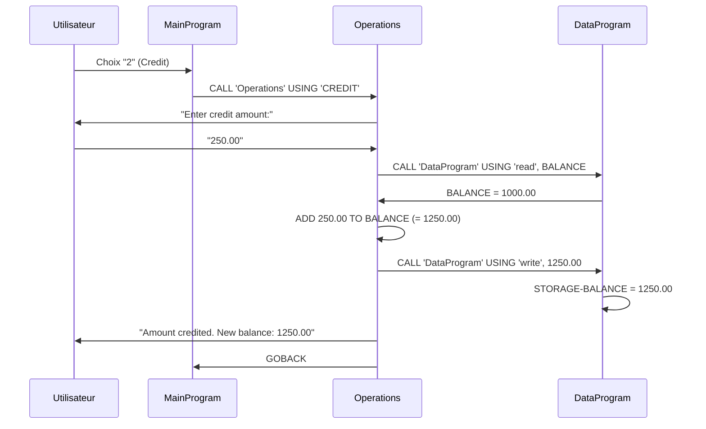

# Documentation Technique - Programme COBOL Legacy

## 📋 Vue d'Ensemble

Ce document décrit en détail le fonctionnement du système de gestion de compte bancaire écrit en COBOL, composé de trois modules principaux situés dans `modernize-legacy-cobol-app/`.

## 🏗️ Architecture du Système COBOL

### Structure Modulaire

Le système COBOL est organisé en **3 programmes** indépendants qui communiquent via des appels (`CALL`) :

```
┌─────────────────┐    CALL 'Operations'     ┌─────────────────┐
│   MainProgram   │ ─────────────────────────▶│   Operations    │
│   (main.cob)    │                          │ (operations.cob)│
└─────────────────┘                          └─────────────────┘
                                                       │
                                                       │ CALL 'DataProgram'
                                                       ▼
                                              ┌─────────────────┐
                                              │  DataProgram    │
                                              │   (data.cob)    │
                                              └─────────────────┘
```

---

## 📄 Module 1 : MainProgram (main.cob)

### Rôle
Programme principal gérant l'interface utilisateur et le contrôle de flux.

### Structure de Données

```cobol
WORKING-STORAGE SECTION.
01  USER-CHOICE       PIC 9 VALUE 0.        ← Choix utilisateur (1-4)
01  CONTINUE-FLAG     PIC X(3) VALUE 'YES'. ← Flag de continuation
```

### Logique Principale

```cobol
MAIN-LOGIC.
    PERFORM UNTIL CONTINUE-FLAG = 'NO'      ← Boucle principale
        [Affichage du menu]
        ACCEPT USER-CHOICE                   ← Saisie utilisateur
        
        EVALUATE USER-CHOICE                 ← Switch/case
            WHEN 1 → CALL 'Operations' USING 'TOTAL '
            WHEN 2 → CALL 'Operations' USING 'CREDIT'
            WHEN 3 → CALL 'Operations' USING 'DEBIT '
            WHEN 4 → MOVE 'NO' TO CONTINUE-FLAG
            WHEN OTHER → [Message d'erreur]
        END-EVALUATE
    END-PERFORM
```

### Menu Interface
```
--------------------------------
Account Management System
1. View Balance
2. Credit Account
3. Debit Account
4. Exit
--------------------------------
Enter your choice (1-4):
```

---

## 📄 Module 2 : Operations (operations.cob)

### Rôle
Module de logique métier gérant les opérations bancaires.

### Structure de Données

```cobol
WORKING-STORAGE SECTION.
01 OPERATION-TYPE     PIC X(6).    ← Type d'opération reçu
01 AMOUNT             PIC 9(6)V99. ← Montant saisi par utilisateur
01 FINAL-BALANCE      PIC 9(6)V99 VALUE 1000.00. ← Solde de travail

LINKAGE SECTION.
01 PASSED-OPERATION   PIC X(6).    ← Paramètre d'entrée
```

### Types d'Opérations

#### 1. **TOTAL** - Consultation du Solde
```cobol
IF OPERATION-TYPE = 'TOTAL '
    CALL 'DataProgram' USING 'READ', FINAL-BALANCE
    DISPLAY "Current balance: " FINAL-BALANCE
```

#### 2. **CREDIT** - Ajout de Fonds
```cobol
ELSE IF OPERATION-TYPE = 'CREDIT'
    DISPLAY "Enter credit amount: "
    ACCEPT AMOUNT                              ← Saisie montant
    CALL 'DataProgram' USING 'READ', FINAL-BALANCE    ← Lecture solde
    ADD AMOUNT TO FINAL-BALANCE                ← Addition
    CALL 'DataProgram' USING 'WRITE', FINAL-BALANCE   ← Sauvegarde
    DISPLAY "Amount credited. New balance: " FINAL-BALANCE
```

#### 3. **DEBIT** - Retrait de Fonds
```cobol
ELSE IF OPERATION-TYPE = 'DEBIT '
    DISPLAY "Enter debit amount: "
    ACCEPT AMOUNT                              ← Saisie montant
    CALL 'DataProgram' USING 'READ', FINAL-BALANCE    ← Lecture solde
    IF FINAL-BALANCE >= AMOUNT                 ← Vérification fonds
        SUBTRACT AMOUNT FROM FINAL-BALANCE     ← Soustraction
        CALL 'DataProgram' USING 'WRITE', FINAL-BALANCE ← Sauvegarde
        DISPLAY "Amount debited. New balance: " FINAL-BALANCE
    ELSE
        DISPLAY "Insufficient funds for this debit."
    END-IF
```

---

## 📄 Module 3 : DataProgram (data.cob)

### Rôle
Module de persistance des données, équivalent d'une base de données simple.

### Structure de Données

```cobol
WORKING-STORAGE SECTION.
01  STORAGE-BALANCE    PIC 9(6)V99 VALUE 1000.00. ← Solde persistant
01  OPERATION-TYPE     PIC X(6).                   ← Type d'opération

LINKAGE SECTION.
01  PASSED-OPERATION   PIC X(6).     ← Type d'opération (READ/write)
01  BALANCE            PIC 9(6)V99.  ← Solde à lire/écrire
```

### Opérations de Persistance

#### **READ** - Lecture des Données
```cobol
IF OPERATION-TYPE = 'READ'
    MOVE STORAGE-BALANCE TO BALANCE    ← Retourne le solde stocké
```

#### **WRITE** - Écriture des Données
```cobol
ELSE IF OPERATION-TYPE = 'WRITE'
    MOVE BALANCE TO STORAGE-BALANCE   ← Sauvegarde le nouveau solde
```

---

## 🔄 Flux d'Exécution Détaillé

### Scénario : Crédit de 250.00€



---

## 🎯 Types de Données COBOL

### PIC 9(6)V99
- **Format** : 6 chiffres entiers + 2 décimales
- **Exemple** : 123456.78
- **Usage** : Montants monétaires avec précision fixe
- **Limite** : 999999.99

### PIC X(6)
- **Format** : 6 caractères alphanumériques
- **Exemple** : 'CREDIT', 'DEBIT ', 'TOTAL '
- **Usage** : Codes d'opération

### PIC 9
- **Format** : 1 chiffre numérique
- **Exemple** : 1, 2, 3, 4
- **Usage** : Choix du menu

---

## 🔒 Limitations du Système Legacy

### Contraintes Techniques

1. **UN SEUL COMPTE** : Pas de notion d'ID de compte
2. **SOLDE FIXE** : Initialisé à 1000.00
3. **PAS DE VALIDATION** : Montants négatifs non gérés
4. **PERSISTANCE VOLATILE** : Données perdues à l'arrêt du programme
5. **CONCURRENCE** : Pas de gestion multi-utilisateur

### Contraintes Fonctionnelles

1. **Interface textuelle** uniquement
2. **Pas d'historique** des transactions
3. **Pas d'authentification**
4. **Pas de limites** de retrait
5. **Format fixe** des montants

---

## 🔧 Points d'Amélioration pour la Modernisation

### Améliorations Techniques
- ✅ Persistance en fichier/base de données
- ✅ Gestion d'erreurs robuste
- ✅ Types de données modernes (Decimal)
- ✅ Architecture orientée objet
- ✅ Tests unitaires

### Améliorations Fonctionnelles
- ✅ Gestion multi-comptes
- ✅ Validation des montants
- ✅ Historique des transactions
- ✅ Interface graphique potentielle
- ✅ API REST possible

---

## 📊 Mapping COBOL → Python

| **Concept COBOL** | **Équivalent Python** | **Amélioration** |
|-------------------|----------------------|------------------|
| `WORKING-STORAGE` | Attributs de classe | Encapsulation OOP |
| `PIC 9(6)V99` | `Decimal('999999.99')` | Précision arbitraire |
| `CALL 'program'` | Import/méthode | Modules Python |
| `PERFORM UNTIL` | `while` loop | Syntaxe moderne |
| `EVALUATE WHEN` | `match/case` (3.10+) | Pattern matching |
| `ACCEPT/DISPLAY` | `input()/print()` | Interface améliorée |
| Fichiers séquentiels | JSON/SQLite | Formats modernes |

---

## 🧪 Tests de Régression

Pour valider la conformité de la modernisation, reproduire ces scénarios :

### Scénario 1 : Consultation
```
Input: 1
Expected: "Current balance: 1000.00"
```

### Scénario 2 : Crédit
```
Input: 2 → 250.50
Expected: "Amount credited. New balance: 1250.50"
```

### Scénario 3 : Débit Valide
```
Input: 3 → 200.00
Expected: "Amount debited. New balance: 1050.00"
```

### Scénario 4 : Débit Refusé
```
Input: 3 → 1500.00
Expected: "Insufficient funds for this debit."
```

---

## 📝 Notes de Migration

### Comportements à Préserver
1. **Messages identiques** (exact wording)
2. **Ordre des opérations** (read → modify → write)
3. **Gestion des erreurs** (insufficient funds)
4. **Format d'affichage** des montants
5. **Boucle principale** jusqu'à "Exit"

### Comportements à Moderniser
1. **Persistance** des données
2. **Validation** des entrées
3. **Gestion d'erreurs** robuste
4. **Tests automatisés**
5. **Documentation** complète

Ce système COBOL représente un exemple typique d'application legacy des années 1970-1980, avec une architecture simple mais efficace pour son époque.
